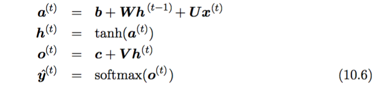

# RNN-implementation
An python implementation of tiny RNN without framework.
This tiny RNN tackles a simple classification task, by outputing "True" if the prefix sum of the sequential input is greater than a certain value.  
This python implementation uses the following formula annotation for readability:
  

- - -
## Instruction to run
The main functional code is in cnn.py.  
Use python3 to run it. "**python3 cnn.py**"   

## Results (only showing testing accuracy)
The accuracy on testing data is **0.097500**  
The accuracy on testing data is **0.153333**  
The accuracy on testing data is **0.320000**  
The accuracy on testing data is **0.886667**  
The accuracy on testing data is **0.900833**  
The accuracy on testing data is **0.903333**  
...

## References

 - [all-about-recurrent-neural-networks](https://medium.com/@jianqiangma/all-about-recurrent-neural-networks-9e5ae2936f6e)  
 - [Build a Recurrent Neural Network from Scratch](https://www.analyticsvidhya.com/blog/2019/01/fundamentals-deep-learning-recurrent-neural-networks-scratch-python/) 
